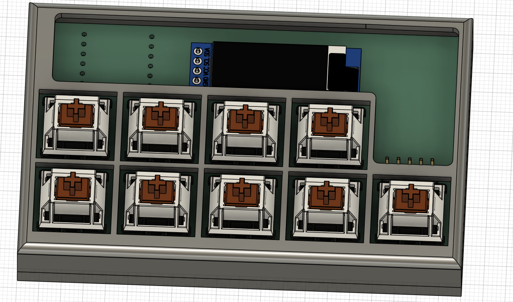
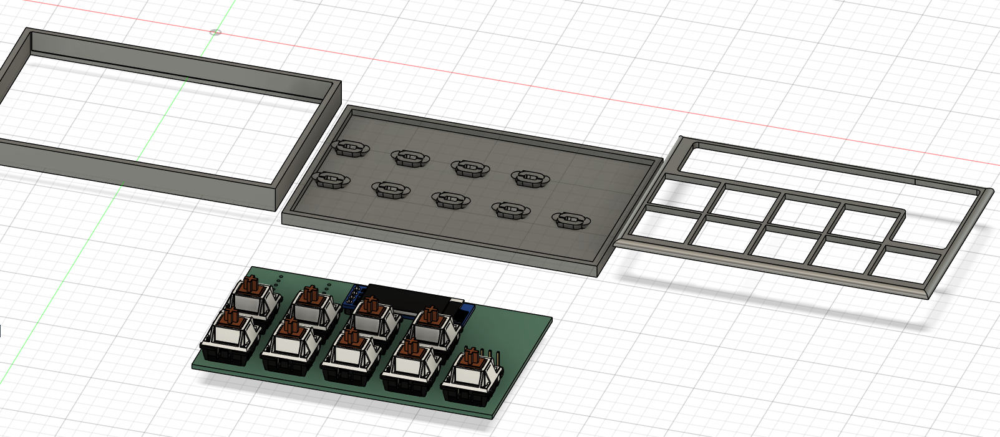
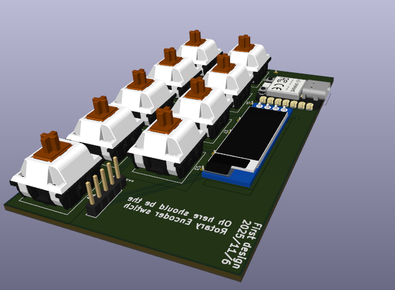
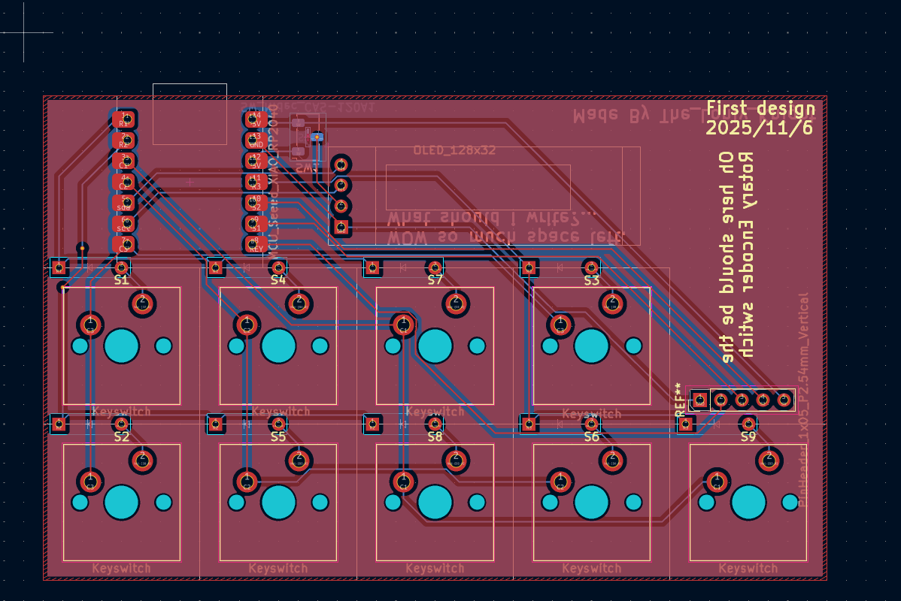
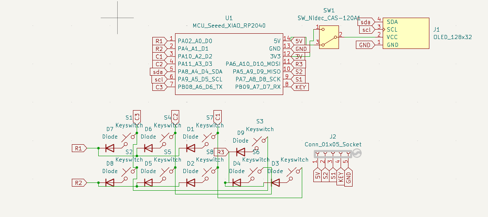

my own hackpad

Features:
Rotary encoder with a switch
9 mechanical switches
128*32 oled screen
compact

Cad model
made of 3 parts will glue them or somthing might change the file later there is the problem with the open space thought it will be cool to be able to see the chip you are allways welcomed to modify the case to fit your need. Also be carefull of the stands for the pcb the diode slot make sure they fit.

PCB
screnshot the images
the other side

Firmware
used
Adafruit_SSD1306 used for simple drawing on the oled
Adafruit_GFX-Library used for more advanced display
Bounce2 used for the buttons or switches
Encoder used for the roatary encoder
Keypad used to enable the matrix layout

will add a program later ot draw stuff or view stuff from pc