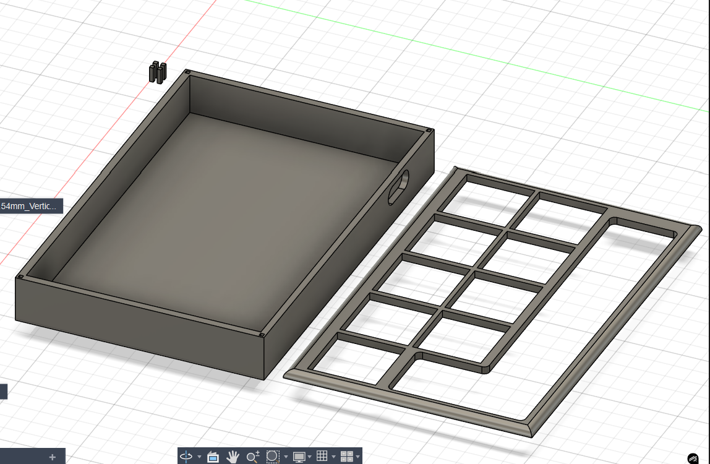
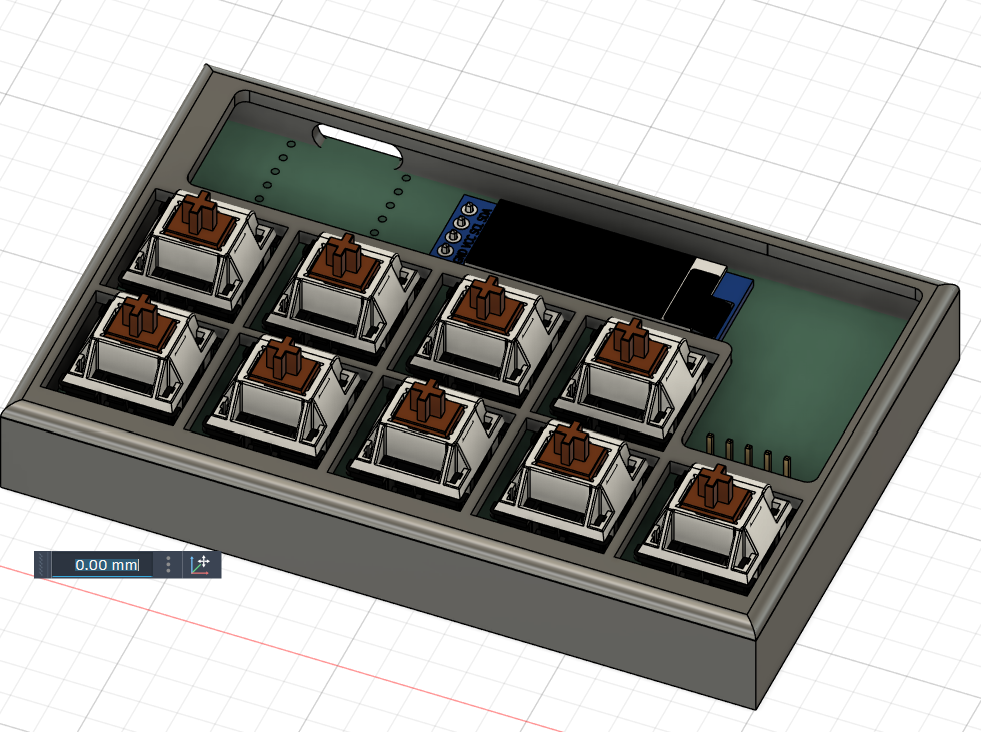
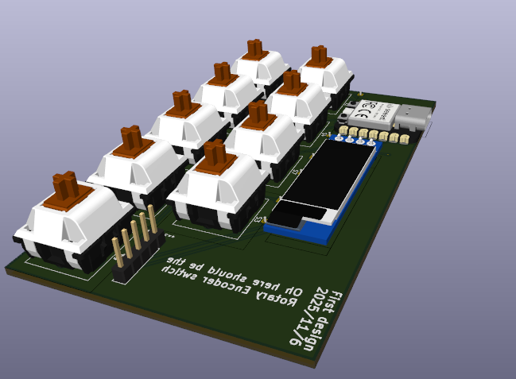
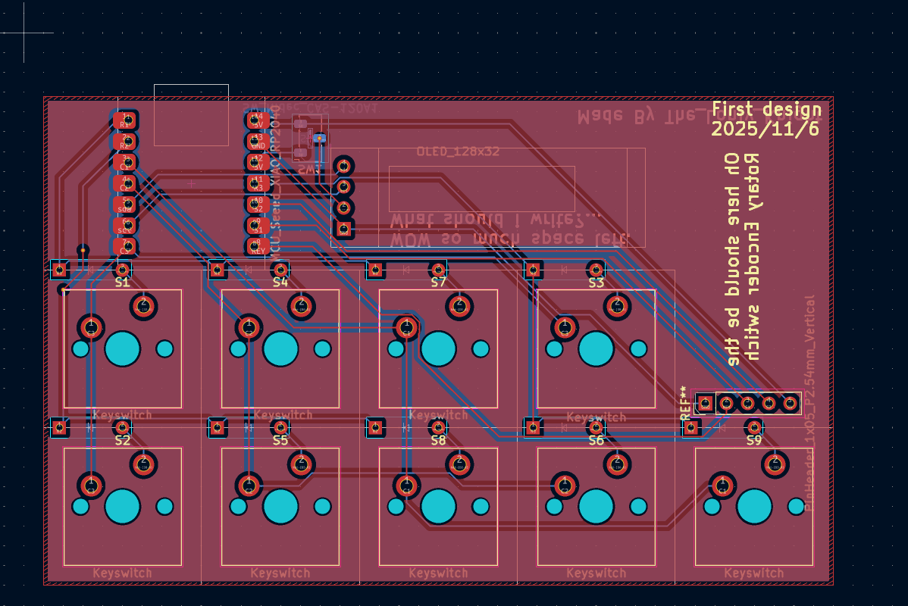
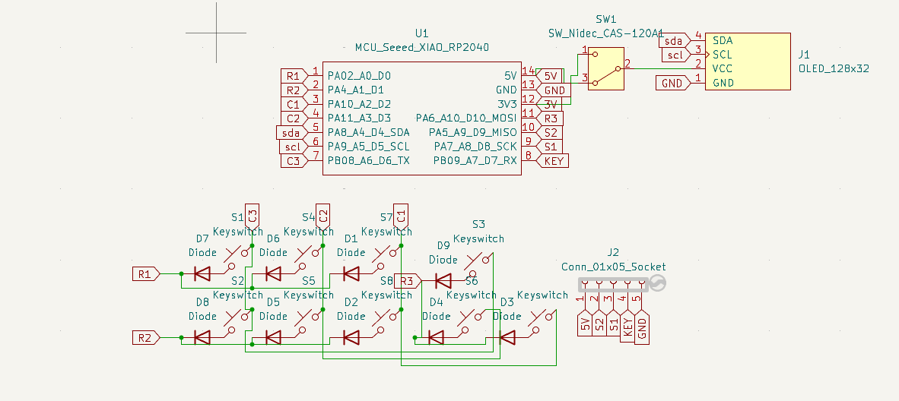
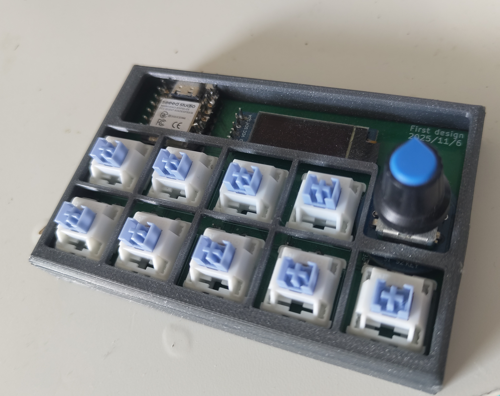

my own hackpad

Features:
Rotary encoder with a switch
9 mechanical switches
128*32 oled screen
compact

Cad model
made of 3 parts will glue them or somthing might change the file later there is the problem with the open space thought it will be cool to be able to see the chip you are allways welcomed to modify the case to fit your need. Also be carefull of the stands for the pcb the diode slot make sure they fit.

PCB
screnshot the images
the other side

!

Firmware used
Adafruit_SSD1306 and Adafruit_GFX-Library are used on the oled screen to draw and edit the screen the adafruit_GFX makes the photo/display text/figure while SSD1306 is used to communicate with the oled screen.
Bounce2 is used to register the press in the rotary switch 
Encoder is used to register the movment of the rotary switch "movment left and right"
Keypad is used to configure thhe keypad and to be able to register the button press 

will add a program later ot draw stuff or view stuff from pc and more.

here is the final version with the case 